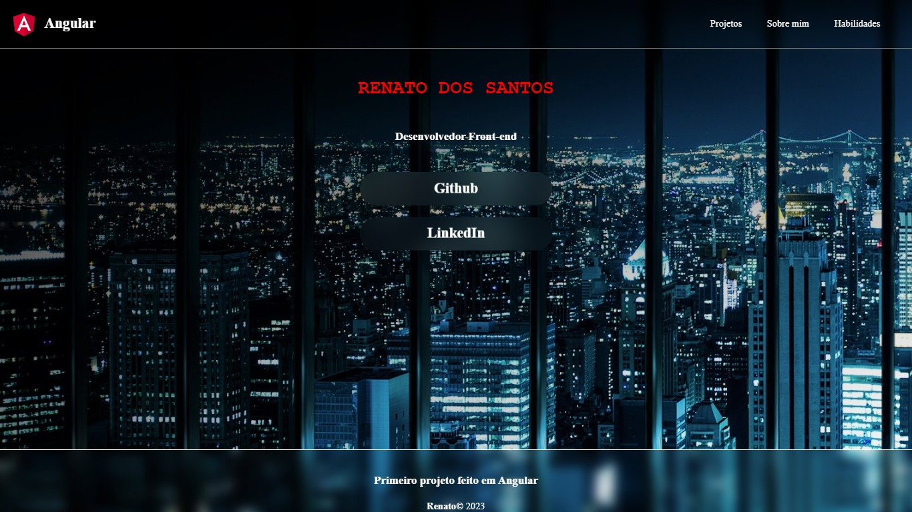

<h1 align="center">  Projeto </h1>

  

 

## 🚀 Tecnologias

Esse projeto foi desenvolvido com as seguintes tecnologias:

## 💻 Projeto

Este projeto foi desenvolvido em angular como primeiro projeto  dos estudos que tem feito  nele si encontro informções sobre mim e links do meu linkedin,github e havera os links dos futuros projetos pessoais.

- [Acesse o projeto finalizado, online](https://renatodev23.github.io/projeto-portfolio-angular/)

